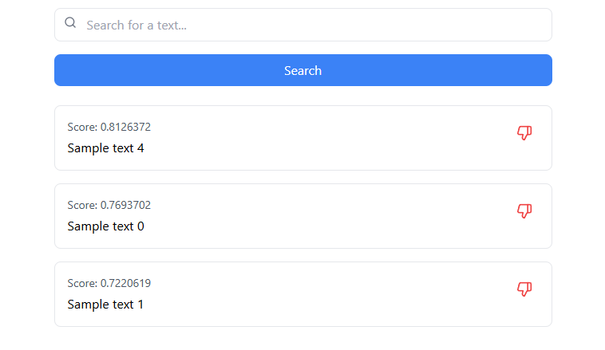

# Search Interface Project

A modern search interface that a demo for deprecating items in a vector database.



## Overview

This project implements a responsive search interface that allows users to find demo data in a vector database. The interface provides search and downvote functionality.

## Features

- Fast search results
- Downvote functionality
- Clean, intuitive user interface


## Getting Started

### Prerequisites

- Docker and Docker Compose

### Installation

1. Clone the repository
   ```bash
   git clone https://github.com/DigitalPhilosopher/Qdrant-Deprecate-Demo
   ```

2. Start the docker containers
   ```bash
   docker-compose up --build -d
   ```
3. Open the search interface in your browser
   ```
   http://localhost:3000
   ```

## Usage

- Search for items using the search bar
- Downvote items to deprecate them in the database. Deprecated items will not be returned in future searches.

## Contributing

Contributions are welcome! Please feel free to submit a Pull Request.

## License

This project is licensed under the MIT License - see the LICENSE file for details.
